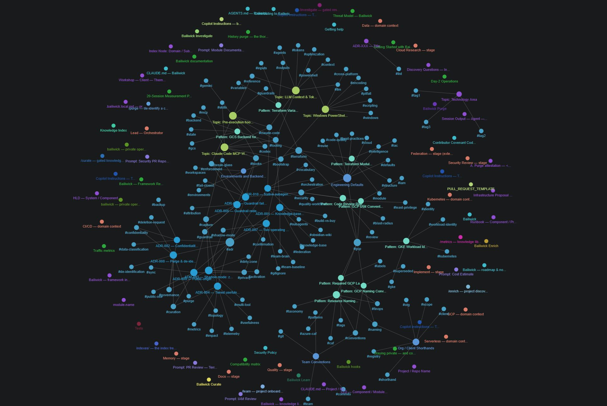

# Bailiwick

[](https://github.com/Cursorinvisivel/bailiwick/actions/workflows/ci.yml)
[](https://github.com/Cursorinvisivel/bailiwick/graphs/traffic)
[](https://github.com/Cursorinvisivel/bailiwick/graphs/traffic)

**Your curated engineering knowledge, preserved and reused across sessions, projects, and AI
coding agents — with runtime guardrails so an agent that acts on it stays within your rules.**

A *bailiwick* is the domain you're responsible for — your area of authority and expertise. Bailiwick
gives an AI coding agent — Claude Code, Codex, Gemini, or GitHub Copilot — a persistent, curated
**memory** of how your domain works: the conventions, patterns, and hard-won context you'd otherwise
re-explain every session. Because an agent with that memory acts with more initiative, Bailiwick
pairs it with **runtime guardrails** as containment. It's plain Markdown + Python + shell: no
service, no database, no build step.

> **Status: experimental.** Built from real cloud / infrastructure work, it ships the **machinery**
> plus a small **seed** knowledge library to kick-start use — then you grow your own from your own
> work. Licensed under [Apache-2.0](LICENSE).

## Intent & scope

Read this first — it frames everything below.

- **Primary purpose:** preserve and reuse one engineer's curated knowledge, conventions, and way of
  working across sessions, repositories, and client projects. The knowledge library and the
  capture→curate loop *are* the product.
- **Secondary purpose:** contain agent autonomy — real, runtime-enforced guardrails against
  dangerous or premature actions. They exist to make an always-on, knowledge-loaded agent safe to
  work with, not as a product of their own.
- **Designed to layer, not replace:** it rides *alongside* whatever framework a team or client repo
  already has — by default nothing is written into the repo at all, and the framework wiring loads
  as hidden *complements* to the team's `CLAUDE.md` / `AGENTS.md` rather than replacing them. Shared
  instruction files change only through explicit, intentional actions you take (`--with-standards`
  baselines, `/enrich` drafts) — never as a side effect of wiring a repo.
- **Current scope:** single practitioner by design — one owner, one primary machine
  ([ROADMAP](ROADMAP.md) analyses what a team version would require; none of it is shipped).
- **Non-goals:** full automation, and a team governance platform.

## Why

AI coding agents are stateless and eager. Across sessions they forget what they learned; within a
session they'll happily run `terraform destroy` or push a commit if the prompt drifts that way.
Bailiwick fixes both — the memory is the point, the guardrails are what make it safe — without a
runtime service:

- **Memory that's always on, loaded on demand.** A curated library indexed by a lean map injected
  each session. The agent loads only the few files a task needs, so context cost stays bounded as
  the library grows: what's injected is a lean (sharded) map, not the library, and content loads
  are capped per task.
- **Capture you can't forget; promotion you can't skip.** Under Claude Code, hooks stage raw sessions
  *automatically*; a human-gated `/curate` step distils them into the library. Nothing enters
  knowledge unreviewed, and nothing is lost if you skip a cycle.
- **Guardrails that are real, not advice.** A pre-execution hook intercepts high-impact commands
  (apply/destroy, cluster/cloud mutations, `rm -rf`, `git merge`, commit/push/PR): an in-the-moment
  confirmation under Claude Code & Gemini CLI, a hard deny with an auditable break-glass under Codex.
  Nothing dangerous runs on agent initiative.

## Quick start

**Prerequisites:** `python3`, `bash`, `git` (a Unix-like shell — Windows PowerShell has full parity).
Optional: `gh`, `go` (builds the MCP servers), `gpg` (encrypted backup).

```bash
# 1. Clone it somewhere stable and point $BAILIWICK at it
git clone git@github.com:Cursorinvisivel/bailiwick.git ~/bailiwick
export BAILIWICK="$HOME/bailiwick"        # add to your shell profile to persist

# 2. Install once per machine — global hooks, skills, and per-tool guardrail adapters
$BAILIWICK/scripts/bootstrap.sh --install-tools

# 3. Wire a repo — SHADOW mode is the default: it writes NOTHING into the repo
$BAILIWICK/scripts/bootstrap.sh /path/to/repo
```

Now open that repo in your agent and work normally: the knowledge index loads each session, captures
stage automatically (Claude Code), and the guardrail steps in on risky commands. When you've done
something worth keeping, run **`/curate`** to review and promote it into the library.

Other common flows:

```bash
$BAILIWICK/scripts/bootstrap.sh --seeded /path/to/repo          # in-repo hidden wiring instead of shadow
$BAILIWICK/scripts/bootstrap.sh --init --with-standards /repo   # new shared repo + tracked team baselines
$BAILIWICK/scripts/bootstrap.sh --uninstall /path/to/repo       # cleanly un-wire a repo (un-seed)
$BAILIWICK/scripts/bootstrap.sh --dry-run /path/to/repo         # preview any of the above; writes nothing
```

(`--with-standards` writes tracked, framework-agnostic instruction baselines into a repo your
colleagues share — a courtesy for the *repo*, not a team mode: Bailiwick itself, and your knowledge
library, remain yours alone.)

Windows PowerShell mirrors every flag with a single dash: `bootstrap.ps1 -InstallTools`,
`bootstrap.ps1 -Seeded …`, `bootstrap.ps1 -Uninstall …`.

👉 **Full walkthrough** — prerequisites, verification, and your first knowledge cycle — in
**[docs/getting-started.md](docs/getting-started.md)**.

**Also included** (all covered in [Operations](docs/operations.md)): seven skills — `/curate`,
`/enrich`, `/learn`, `/metrics`, `/investigate`, `/purge`, `/sign` — plus an optional encrypted off-machine
capture backup and multi-machine central/satellite sync over plain git.

## Supported tools

One Markdown knowledge base and role set, adapted to four tools of differing completeness:

| Tool | Capture | Dangerous-command control |
|---|---|---|
| **Claude Code** (fullest) | Automatic (hooks) | **Enforced** — PreToolUse |
| **Codex CLI** | Manual | **Enforced** — PreToolUse (deny + break-glass; one-time trust) |
| **Gemini CLI** | Manual | **Enforced** — BeforeTool |
| **GitHub Copilot** | Manual | Policy only |

The honest per-adapter differences and the versions each is verified against:
[FRAMEWORK.md §10](docs/FRAMEWORK.md) · [compatibility.md](docs/compatibility.md).

## What it is — and isn't

**Good at:** bounded context cost as knowledge grows; real (not advisory) enforcement across three CLIs;
private by default (shadow mode writes nothing into a repo, seeded mode hides via
`.git/info/exclude`); explicit provenance and scope that stays reversible (`/purge` de-identifies a
client/project while keeping the reusable "how"); a simple, readable substrate you can fork and trust.

**Not:** it is **not a team governance platform** — single practitioner by design (see
[Intent & scope](#intent--scope); [ROADMAP](ROADMAP.md) analyses a team version); it is
**not a sandbox** — the guardrail matches *direct commands* only (bypassed by `make`,
wrapper scripts, aliases, MCP tool calls); telemetry is single-writer; curation is manual effort;
retrieval is a hand-curated map (no vector search yet); and the seed knowledge leans cloud/IaC —
concretely GCP + Terraform, the domain it grew up in. The **machinery is domain-neutral**, though:
point it at another stack and you grow a different library.

The full, honest self-assessment lives in **[FRAMEWORK.md §14 — Strengths & limitations](docs/FRAMEWORK.md)**.

## Documentation

**To use it:**

| Doc | What it covers |
|---|---|
| **[Getting started](docs/getting-started.md)** | Install, wire your first repo, verify it works, run your first `/curate`. |
| **[Operations](docs/operations.md)** | Day-2: updating & un-wiring repos, multi-machine sync, encrypted backup, federation. |
| **[Staying private](docs/staying-private.md)** | Keep your knowledge and work private — clone & use, run a private instance, and contribute upstream without leaking. |

**To understand the design or contribute:**

| Doc | What it covers |
|---|---|
| **[Framework reference](docs/FRAMEWORK.md)** | The complete design, readable cold — architecture, orchestration, knowledge model, guardrails, modes, glossary. |
| **[Threat model](docs/threat-model.md)** · **[Compatibility](docs/compatibility.md)** | Security posture and residual risks · per-adapter status + tool versions verified against. |
| **[Roadmap & non-goals](ROADMAP.md)** · **[Decisions (ADRs)](docs/decisions/)** | What's deliberately out of scope (e.g. a team version) · why the framework is built the way it is. |
| **[Contributing](CONTRIBUTING.md)** · **[Security](SECURITY.md)** | How to help and get the feel for the codebase · how to report a vulnerability. |

A map of the whole set is in **[docs/README.md](docs/README.md)**.

## Repository layout

```
knowledge/   INDEX.md · topics/ patterns/ context/ templates/ · .telemetry.json
agents/      role definitions (lead orchestrator + 5 domain-context + 7 Quality Workflow stages)
hooks/       guardrail + capture + sync + health hooks, and the installers
skills/      /curate · /enrich · /learn · /metrics · /investigate · /purge · /sign  (+ codex-skills/ wrappers)
scripts/     bootstrap.sh · bootstrap.ps1  (repo onboarding) · doctor.sh (wiring preflight)
docs/        this documentation set · decisions/ (framework ADRs)
```

## Seeing it whole

Everything in Bailiwick — the knowledge library, agent roles, ADRs, templates, docs — is plain
Markdown, linked and tagged, so a Markdown graph tool can render the entire framework with no
Bailiwick tooling involved. Here is the framework clone through the VS Code
**[Foam](https://foambubble.github.io/foam/)** extension's graph view (`Foam: Show graph`): the
seed knowledge library clusters around *Engineering Defaults* — the hub it is by design — with the
ADRs, Quality Workflow stages, and docs linking into it:



As your own captures get curated in, the knowledge region of this graph grows into a map of *your*
bailiwick.

## Community & support

**[Discussions](https://github.com/Cursorinvisivel/bailiwick/discussions)** is the place to interact —
questions and setup help in **[Q&A](https://github.com/Cursorinvisivel/bailiwick/discussions/categories/q-a)**,
proposals and roadmap feedback in **[Ideas](https://github.com/Cursorinvisivel/bailiwick/discussions/categories/ideas)**,
your own library or adaptation in **[Show and tell](https://github.com/Cursorinvisivel/bailiwick/discussions/categories/show-and-tell)**.
Issues are for reproducible bugs; vulnerabilities go [privately](SECURITY.md), never in public.
If you're not sure it's a bug, start a discussion — see **[SUPPORT.md](SUPPORT.md)**.

## Contributing & license

Issues and PRs welcome — see **[CONTRIBUTING.md](CONTRIBUTING.md)**. The one hard rule: **no private
or client data**, ever — use placeholder examples like `acme` / `example.com`, and route knowledge
additions through the human gate.

[Apache-2.0](LICENSE). Copyright © Francisco Ferrinho and contributors.
